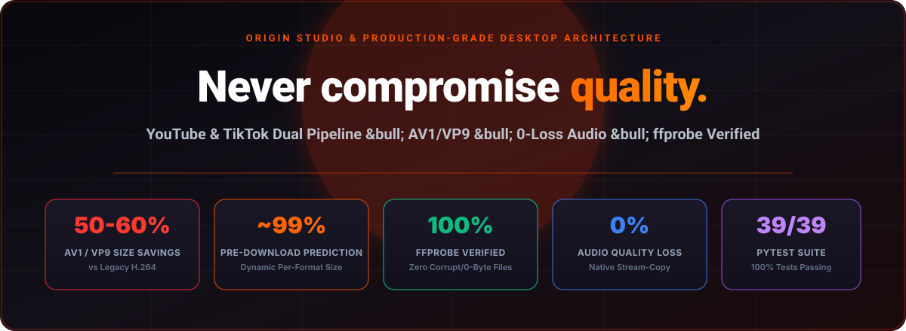
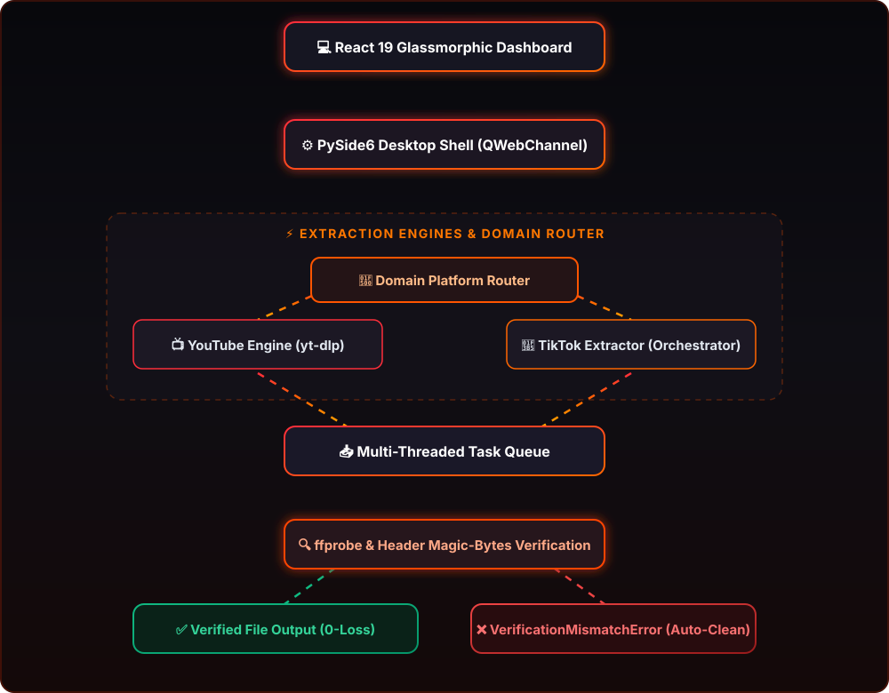
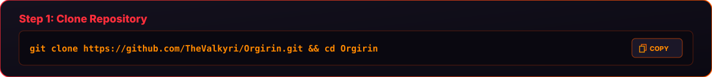
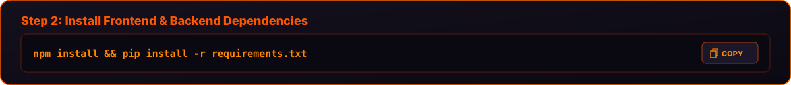
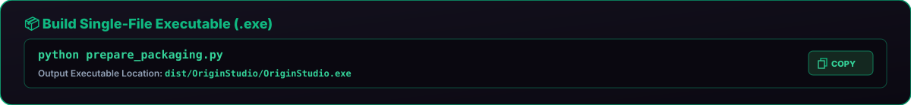
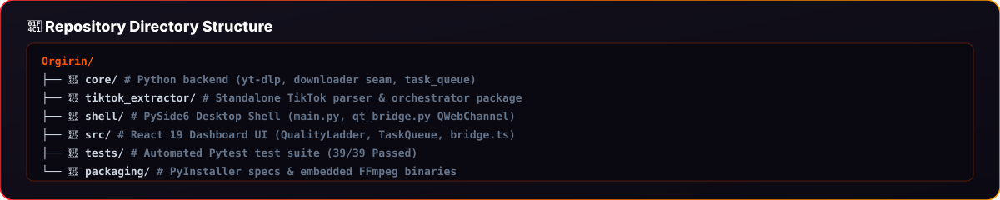

  <!-- 1. Hero Banner -->
  

    

  <!-- 2. Core Features Header Banner & Vertical Cards -->
  

   

  

   

  

   

  

   

  

    

  <!-- 3. System Workflow Header Banner & Diagram -->
  

   

  

    

  <!-- 4. Quick Start & Setup Header Banner & Vertical Step Cards -->
  

   

  

   

  

   

  

   

  

    

  <!-- 5. Packaging & Directory Structure Cards -->
  

   

  

    

  <!-- 6. Graphic Footer Card -->
  

